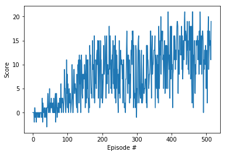

[//]: # (Image References)

[image1]: https://user-images.githubusercontent.com/10624937/42135619-d90f2f28-7d12-11e8-8823-82b970a54d7e.gif "Trained Agent"

# Banana Collection Agent 

This is an exercise of Deep Reinforcement Learning to try an agent to collect as many bananas on a Unity environment. 

## Environment Overview

![Trained Agent][image1]

This environment is based on Unity, and has following attributes. 

#### Reward
- A reward of +1 is provided for collecting a yellow banana
- A reward of -1 is provided for collecting a blue banana

#### State Space

- Continuous 37 dimensions and contains
    - the agent's velocity
    - ray-based perception of objects around agent's forward direction

#### Action Space
- Discrete 4 actions 
    - **`0`** - move forward.
    - **`1`** - move backward.
    - **`2`** - turn left.
    - **`3`** - turn right.

## Goal of the agent 

- get an average score of +13 
- for 100 consecutive eposodes 

## Algorithm 

Used a simple deep newron network. With following acrhtecture 
- Fully connected layer 1 (64) with ReLu  
- Fully connected layer 2 (64) with ReLu
- Fully connected layer 3 (37) 

## Performance

- Score by epoches is asbelow. The model reached to average score > 13.0 around 500 epoches. 

## Ideas for Future Work

- Architecture: Currently, just used simple NN. Going forward, using more complex architecture may improve the score
- Hyperparameter: the parameter has not been fully optimized. Here is another opportunity of improvement

## How to Run

- The trained model is `checkpoint.pth`. You can use this on Unity environment

## Dependencies

1. Download the Unity environment from one of the links below
    - Linux: [click here](https://s3-us-west-1.amazonaws.com/udacity-drlnd/P1/Banana/Banana_Linux.zip)
    - Mac OSX: [click here](https://s3-us-west-1.amazonaws.com/udacity-drlnd/P1/Banana/Banana.app.zip)
    - Windows (32-bit): [click here](https://s3-us-west-1.amazonaws.com/udacity-drlnd/P1/Banana/Banana_Windows_x86.zip)
    - Windows (64-bit): [click here](https://s3-us-west-1.amazonaws.com/udacity-drlnd/P1/Banana/Banana_Windows_x86_64.zip)
    

2. Place the file in this repository and unzip 

